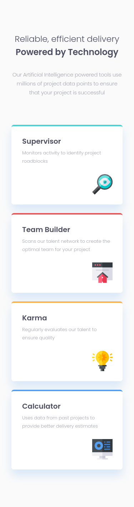
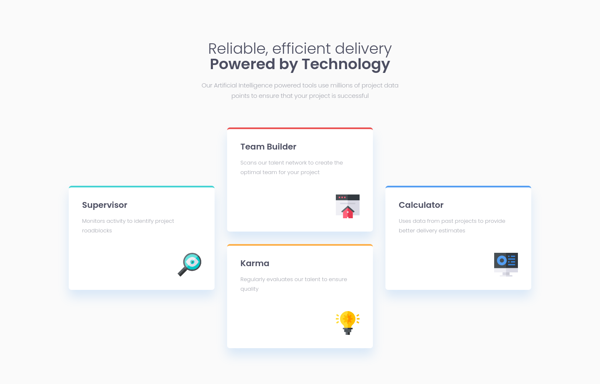

# Frontend Mentor - Four card feature section solution

This is a solution to the [Four card feature section challenge on Frontend Mentor](https://www.frontendmentor.io/challenges/four-card-feature-section-weK1eFYK). Frontend Mentor challenges help you improve your coding skills by building realistic projects. 

## Table of contents

- [Overview](#overview)
  - [The challenge](#the-challenge)
  - [Screenshot](#screenshot)
  - [Links](#links)
- [My process](#my-process)
  - [Built with](#built-with)
  - [Useful resources](#useful-resources)
- [Author](#author)

**Note: Delete this note and update the table of contents based on what sections you keep.**

## Overview

### The challenge

Users should be able to:

- View the optimal layout for the site depending on their device's screen size

### Screenshot

#### Mobile

#### Desktop

### Links

- Solution URL: [Solution URL](https://your-solution-url.com)
- Live Site URL: [Live site URL](https://your-live-site-url.com)

## My process

### Built with

- Semantic HTML5 markup
- CSS logical properties
- Flexbox
- CSS Grid
- Mobile-first workflow
- SASS

### Useful resources

- [CSS logical properties and values](https://developer.mozilla.org/en-US/docs/Web/CSS/CSS_Logical_Properties) - It was my first time using this and i really like it a lot, very useful.

## Author

- Frontend Mentor - [@Ascecent](https://www.frontendmentor.io/profile/Ascecent)
